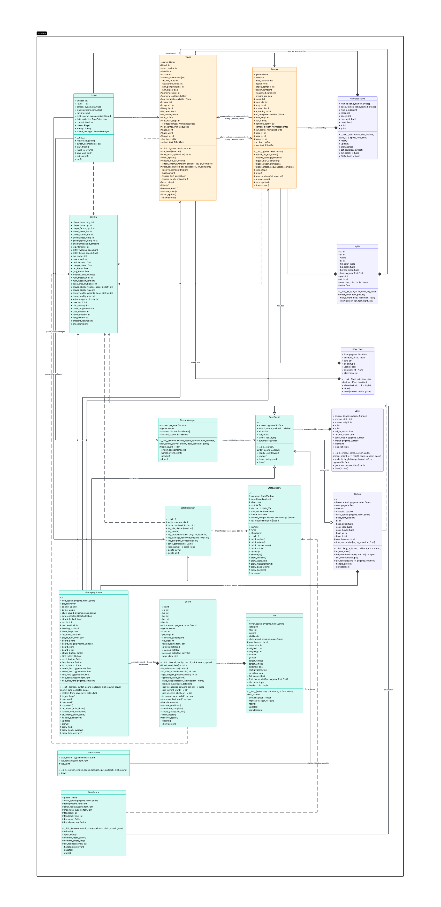

# Project Description

## 1. Project Overview

Provide a high-level understanding of the project.

- **Project Name:**  
  WordForge
- **Brief Description:**  
  WordForge is a word-puzzle battle game inspired by Bookworm Adventures where players create words from a grid of letter tiles to attack enemies. Players connect letters to form valid English words, and each word deals damage based on its length, special tile effects, and level scaling mechanics. The game combines vocabulary skills with strategy by introducing colored tiles that grant unique combat abilities such as healing, freezing enemies, or increasing attack damage.

  The game features an infinite-level progression system where enemy health, damage, and abilities scale mathematically as the player advances. Players must survive increasingly difficult battles by forming efficient words, managing resources such as rerolls and hints, and taking advantage of tile combinations. The system also includes game statistics tracking and a save system that allows players to continue their progress later.

- **Problem Statement:**  
  It solves the problem of the original game having a fixed number of levels. Our game features infinite levels.

- **Target Users:**  
  It can be played by people of all ages.

- **Key Features:**
  - Ability tiles
  - Reroll and Hint mechanics
  - Infinite levels

---

## 2. Concept

### 2.1 Background

Explain the foundation of the project.

- Why this project exists  
  I really love this game because it was the only game I could play in computer class when I was young.
- What inspired the project  
  I wanted to recreate the game I used to play and love.
- Importance of solving this problem  
  The original game has a fixed number of levels. Once I completed it, I wanted to keep playing, but it would just replay all the levels I had already beaten. So I created my own version with infinite levels.

### 2.2 Objectives

Define the goals of the system.

- Clear objectives of the project  
  Create my own game that works like the original and solves the problem I used to encounter - fixed levels.
- What the system aims to achieve  
  Build an algorithm to search and validate words as fast as possible.

---

## 3. UML Class Diagram

[WordForge UML Class Diagram](WordForge_UML_Class_Diagram.pdf)

---

## 4. Object-Oriented Programming Implementation

- **Config:** A static data class that centralizes all game-wide constants and tunable parameters, including player/enemy stats, ability weights, letter frequencies, sound filenames, and volume levels. No instances are created; all values are accessed directly from the class.

- **Game:** The top-level application controller that initializes pygame, owns the canonical `Player`, `Enemy`, and `DataCollection` instances, and drives the main game loop. It is also responsible for save/load orchestration and scene switching.

- **Player:** Represents the human-controlled character. Manages health, score, status effects (frozen, weakened), and a multi-step attack animation sequence. Resolves word-based damage output including ability modifiers and applies results to the `Enemy`.

- **Enemy:** Represents the AI-controlled opponent for the current level. Manages its own health, attack damage (scaled by level), status effects, and a multi-step attack animation sequence. Rolls a random ability each turn and applies its effect to the `Player`.

- **Board:** Manages the 4×4 letter tile grid. Handles board generation (guaranteed to contain at least one valid 3-letter word), tile selection, word validation, gravity/refill after tiles are consumed, and delegating attacks to `Player`.

- **Tile:** Represents a single letter tile on the board. Tracks its letter, grid position, ability type, selection state, and smoothly animates movement toward a target position each frame. Renders itself with color-coded ability highlighting.

- **AnimatedSprite:** A reusable sprite-sheet helper that slices a horizontal strip into frames and cycles through them at a configurable speed. Supports one-shot playback, scaling, and horizontal flipping.

- **HpBar:** Renders a health bar with smooth animated fill, right-to-left or left-to-right fill direction, status-effect color overrides (blue for frozen, purple for weakened), and text labels for level and current HP.

- **EffectText:** Displays a temporary or persistent text label with a drop shadow at a given screen position. Used for mid-combat feedback messages such as heal amounts or status effect announcements.

- **Button:** A clickable UI button with hover scaling, color brightening on hover, a drop shadow on the label, and one-shot hover sound. Supports runtime color changes (e.g., turning green when a valid word is selected).

- **Layer:** Renders a repeating parallax background image. Supports optional random per-tile scaling and horizontal flipping to create a naturalistic forest backdrop.

- **DataCollection:** Handles all persistent I/O. Writes structured rows to a CSV log for analytics, serializes and deserializes full game state to/from a JSON save file, and exposes deletion helpers for the Stats screen.

- **SceneManager:** Owns the three scene instances (`MenuScene`, `GameplayScene`, `StatsScene`) and routes `handle_event`, `update`, and `draw` calls to whichever scene is currently active. Also manages music transitions on scene switches.

- **BaseScene:** Abstract base class for all scenes. Initializes the four parallax `Layer` objects and an empty `buttons` list, and provides `draw_background()` and default `handle_event()` / `update()` / `draw()` methods for subclasses to override.

- **MenuScene:** The main menu screen. Renders the game title and three navigation buttons (Start, Stats, Quit), each wired to a scene-switch or quit callback.

- **GameplayScene:** The primary gameplay screen. Orchestrates the full combat turn cycle: player word selection → attack → enemy retaliation → level-up. Also owns the `Board`, renders the HUD, and displays help and death overlays.

- **StatsScene:** The statistics screen. Launches the separate `StatsWindow` in a background thread and exposes Reset Game and Delete Log buttons with inline feedback messages.

- **StatsWindow:** A standalone Tkinter window (runs in its own thread) that reads the CSV log and renders five matplotlib charts: tile clicks over time (line), words by length (table), damage dealt (boxplot), word-length spread (histogram), and time-to-beat-level (bar chart).

---

## 5. Statistical Data

### 5.1 Data Recording Method

Data collection and storage in WordForge is handled entirely by the `DataCollection` class, which manages two separate persistence mechanisms: a CSV log file for analytics and a JSON file for game save state.

---

**CSV Log File (`lib/stats/log_1.csv`)**

Every meaningful in-game event is appended as a new row to the CSV log file in real time. The file is created automatically with a header row if it does not already exist. Each row shares the same seven columns:

| Column            | Description                                              |
| ----------------- | -------------------------------------------------------- |
| `timestamp`       | Date and time of the event (`YYYYMMDD_HHMMSS`)           |
| `tile_clicked`    | `True` if the player clicked a tile, otherwise empty     |
| `damage_received` | Damage the player took that turn, otherwise empty        |
| `created_word`    | The word the player submitted, otherwise empty           |
| `damage_dealt`    | Damage dealt to the enemy that turn, otherwise empty     |
| `current_level`   | The level the player was on when the event occurred      |
| `program_closed`  | `True` if the game was closed that turn, otherwise empty |

Because only one type of event is recorded per row, most columns in any given row are empty strings. The five event types that trigger a write are:

- **Tile clicked** - logged every time the player taps a tile on the board.
- **Attack** - logged when the player submits a valid word, recording the word and damage dealt.
- **Damage received** - logged each time the player takes damage from the enemy.
- **Program closed** - logged when the player exits the game, marking the final level reached.
- **Death** - logged when the player's HP reaches zero.

---

### 5.2 Data Features

The statistics window displays five distinct views, each exposing different characteristics of the data recorded during gameplay.

---

**1. Tile Clicks Over Time (Line Graph)**  
Tile-click events are bucketed into 20-second intervals and plotted as a line graph. The data is sequential and time-ordered. Dense clusters indicate active tile exploration, while sparse periods reflect hesitation or strategic thinking.

---

**2. Words Created by Length (Table)**  
All submitted words are grouped by character length, with up to eight unique example words shown per group. The data is discrete and categorical, ranging from 3 to 16 letters. The distribution is typically right-skewed, with most words falling in the 3-6 letter range.

---

**3. Damage Dealt Distribution (Boxplot)**  
All damage values from every player attack are summarized in a boxplot showing the minimum, median, maximum, and outliers. The spread is wide because damage depends on word length, level scaling, and ability tile multipliers. High outliers correspond to attacks using boosted tiles or bonus-triggering letter patterns.

---

**4. Word Length Spread (Histogram)**  
Word lengths across all submitted words are shown as a frequency histogram, with a dashed line marking the mean. The data is discrete and bounded between 3 and 16. A distribution skewed toward shorter words suggests speed-focused play, while a shift toward longer words suggests a more deliberate playstyle.

---

**5. Time to Beat Level (Bar Graph)**  
Each completed level is categorized into one of three time bands: under 1 minute, 1-3 minutes, or over 3 minutes. The bar height shows how many levels fell into each band. Short completion times reflect efficient high-damage word choices, while longer times may indicate difficulty or frequent hint usage.

---

## 6. Changed Proposed Features

Changed collected data visualization methods

From:

1. Tile Clicking (every 20s) (Line Graph)
2. Words Created (by length) (Table)
3. Damage Dealt (overall) (Histogram)
4. Damage Dealt (every 20s) (Boxplot)
5. Damage Received (every 20s) (Scatter Plot)
6. Time to Complete Level (Bar Graph)

To:

1. Tile Clicks Over Time (Line Graph)
2. Words Created by Length (Table)
3. Damage Dealt Distribution (Boxplot)
4. Word Length Spread (Histogram)
5. Time to Beat Level (Bar Graph)

Due to the difficulty of the original collection methods and visualization approach discovered after testing with real gameplay data.

---

## 7. Youtube Video

---

## 8. External Sources

Acknowledge to:

1. All Sound effects, <https://pixabay.com/sound-effects/> [SFX]
2. All Textures, <https://itch.io/game-assets/tag-pixel-art> [Texture]
3. Word library, <https://github.com/dwyl/english-words> [Word validation database]
4. Minecraftory Font, <https://www.dafont.com/minercraftory.font> [Font]
