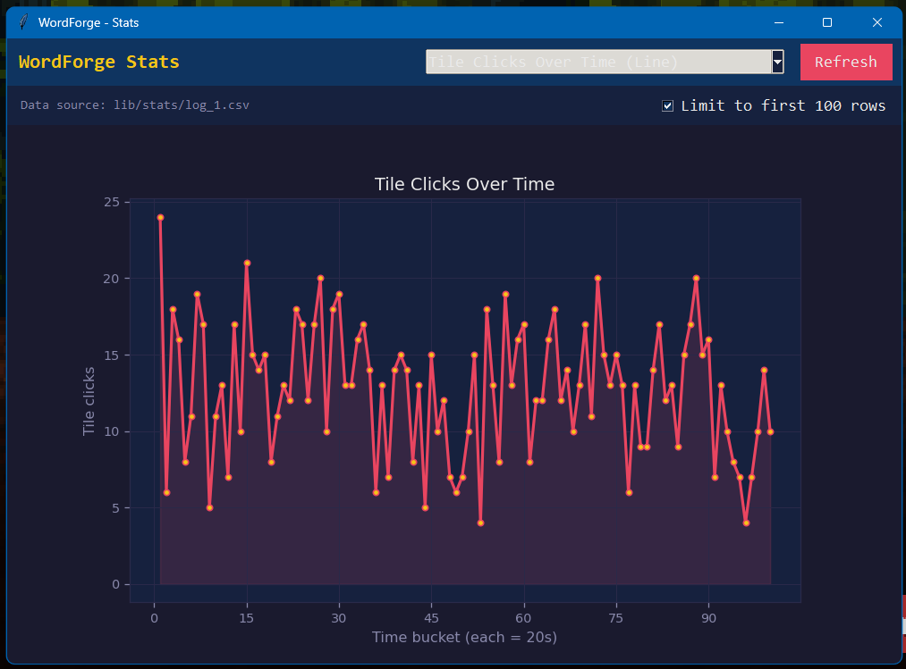
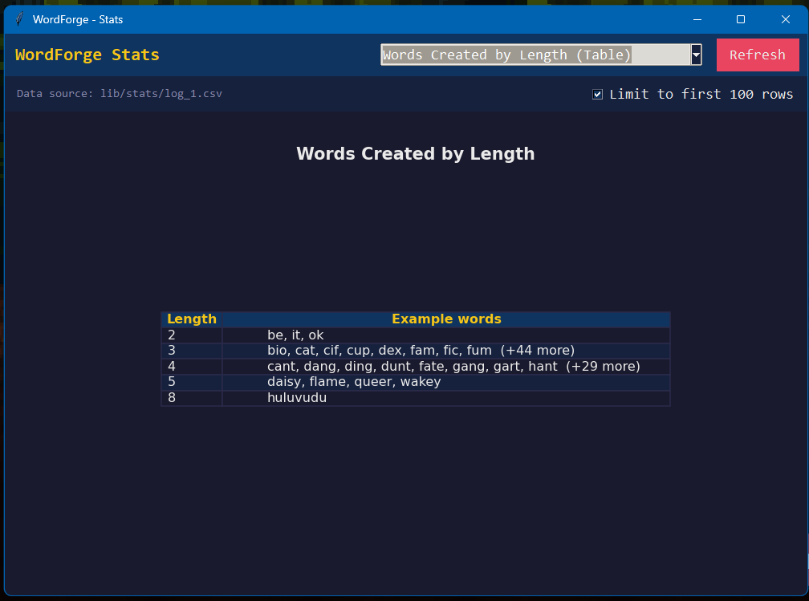
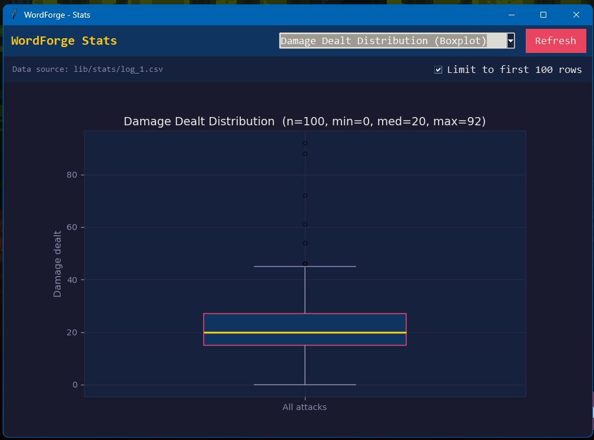
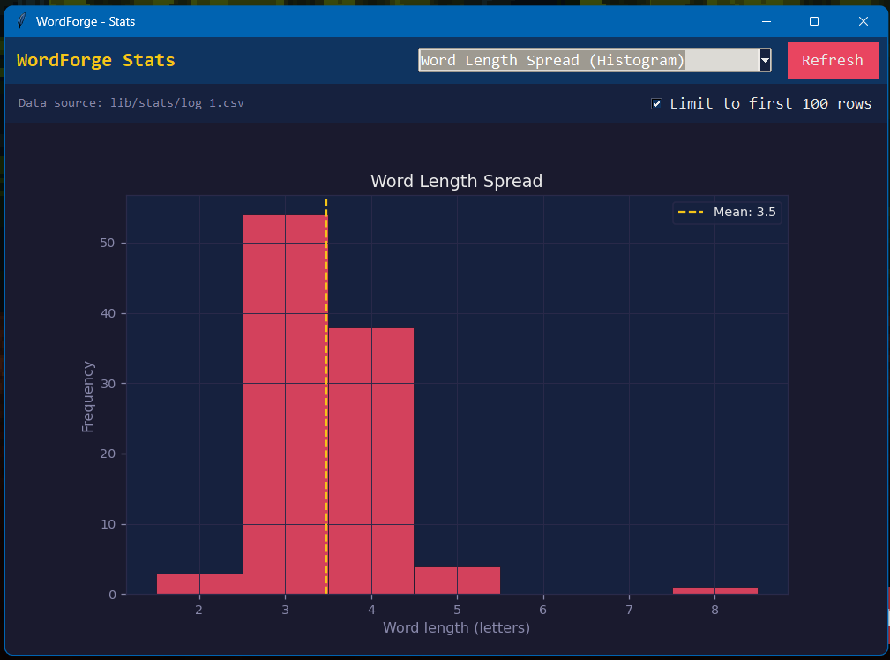
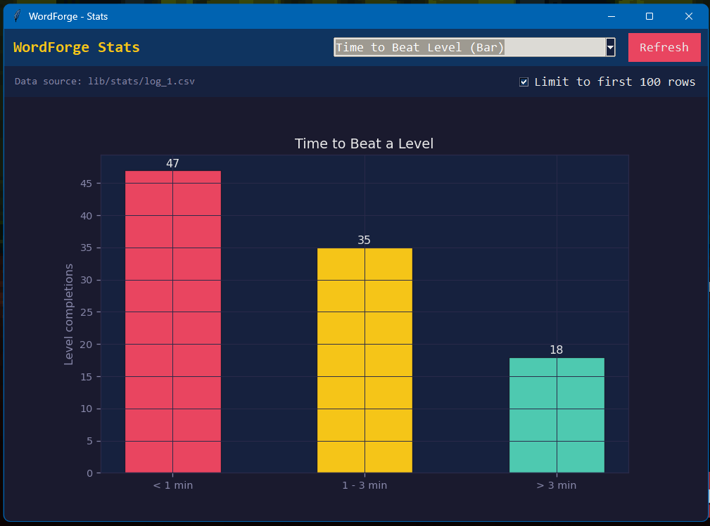

# Visualization

The checkbox "Limit to first 100 rows" means the data will display only the first 100 valid rows.

---

## 1. Tile Clicks Over Time (Line Graph)

**Explanation:** The line graph shows tile click activity grouped into 20-second intervals across approximately 100 time buckets. The click count fluctuates consistently between 5 and 25 clicks per bucket, with no clear upward or downward trend, suggesting the player maintained a fairly steady interaction pace throughout the session. The high variability between adjacent buckets indicates that the player alternated between quickly cycling through multiple tile combinations and briefly pausing to evaluate options before committing to a word.

---

## 2. Words Created by Length (Table)

**Explanation:** The table groups all submitted words by character length. The majority of words formed were 3 and 4 letters long, with 3-letter words having at least 44 additional entries beyond the 8 shown and 4-letter words having at least 29 more, confirming that short words dominated the player's strategy. Only a single 8-letter word ("huluvudu") was recorded, standing out as a rare high-value attack. This distribution reflects a speed-over-length playstyle, where the player preferred forming quick, short words rather than searching for longer, higher-damage ones.

---

## 3. Damage Dealt Distribution (Boxplot)

**Explanation:** The boxplot summarizes 100 recorded attacks with a minimum of 0, a median of 20, and a maximum of 92. The interquartile range is compact and centered around 20, indicating that the majority of attacks dealt a consistent and moderate amount of damage. Several high outliers above 40 - reaching up to 92 - correspond to attacks that likely used boosted ability tiles (orange, red, or gray) or triggered bonus multipliers from rare letter patterns. The minimum value of 0 reflects turns where the hint penalty was active, nullifying all damage output.

---

## 4. Word Length Spread (Histogram)

**Explanation:** The histogram displays the frequency of each word length across all submitted words, with a mean of 3.5 letters marked by the dashed gold line. The distribution is heavily right-skewed, with 3-letter words being the most frequent (over 53 occurrences), followed closely by 4-letter words (around 38 occurrences). Words with a length of 5 appear only a handful of times, and the single 8-letter word appears as an isolated bar far to the right. This strongly confirms that the player consistently prioritized short, fast words over longer, more damaging ones.

---

## 5. Time to Beat Level (Bar Graph)

**Explanation:** The bar graph shows that, out of 100 recorded level completions, 47 levels were beaten in under 1 minute, 35 levels were completed in 1–3 minutes, and 18 levels took over 3 minutes. The dominance of the under 1 minute range suggests that the player typically spent a short amount of time per level, indicating quick decision-making and efficient gameplay. Meanwhile, the smaller number of levels taking over 3 minutes suggests that only certain difficult encounters, such as higher-level enemies with larger HP pools, required extended combat and more attack turns to defeat.
